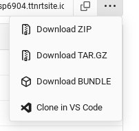

# Setup your Git client

Here is a tutorial on setting up Git within your repository. This page is important when you are making big changes to your code.

### Creating your repo

To start off, you should create a repository on your account. Then you should make it with a README file, so that you don't have to do that later on.

### Clone your repo

After creating your repository, you can clone your repo. For this to work, you can either:

1. Use the Git command
2. Download as a archive

The following sections will show on how to do so.

#### Using the Git command

Go to your repository. Look for a icon next the triple dots button. It will have a Copy button along with a link next to it. The URL would look like this:

```
https://git.ttnrtsite.me/YOURUSERNAME/YOURREPO.git
```

Copy the link using the button so that it is in your clipboard. Then open your preferred terminal app, and type in this:

```
git clone https://git.ttnrtsite.me/YOURUSERNAME/YOURREPO.git
```

Make sure you have the Git source control app installed before doing this.

#### Using the archive version

Click the 3-dots button next to the git URL copy button. You will see this once done:

<figure><figcaption></figcaption></figure>

Click on the archive format you want to download. For example, we will use the ZIP format option. Click that and wait for your download to start. Once downloaded, open the folder where it is located. You should unzip the file to extract all the items inside the archive. You can use whatever tool you like for this. For this, we will use 7zip. You can extract them to any location that suits you.

### Setup the authorization

Once you made your changes to your content, you need to setup the authorization to help Git talk to your repository. For this, open a terminal within your folder. After you do that, type the following commands:

Config your username

```
git config --global user.name "YOURUSERNAME"
```

Config your email

```
git config --global user.email "YOUREMAIL"
```

### Commit your changes

Once all of that is done, you can now push your changes. Depending on what software or method you use for pushing or pulling, you will have to use either:

1. Using the terminal interface
2. Using a IDE editor (with Git built in)

You can use whatever fits you. At some point, you will need to authorize via your browser (if using windows) or with a IDE editor (if using Visual Studio Code). If the push was successful, you can check back at the TTGit site and see if your changes are pushed.

### Sources

* [Setup Git](https://docs.github.com/en/get-started/getting-started-with-git/set-up-git)
* [VSCode Git setup](https://code.visualstudio.com/docs/sourcecontrol/overview)
* [Git documentation](https://git-scm.com/docs)
